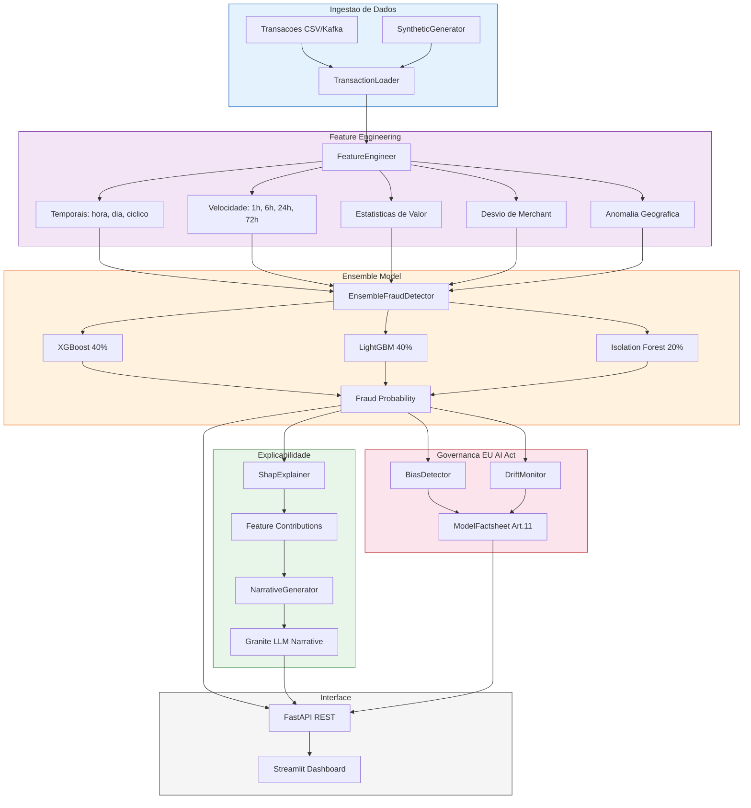
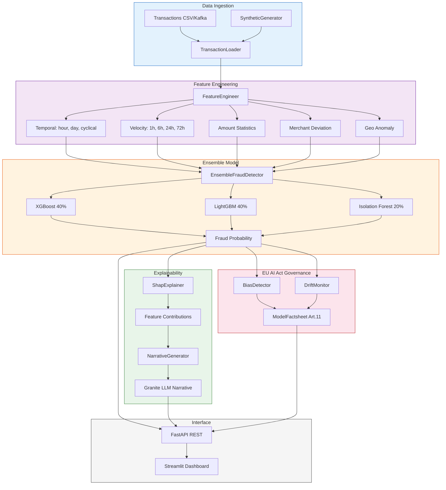

# Watsonx Financial Fraud Detection & Governance

[](https://www.python.org/)
[](https://www.ibm.com/watsonx)
[](https://xgboost.readthedocs.io/)
[](https://lightgbm.readthedocs.io/)
[](https://shap.readthedocs.io/)
[](https://fastapi.tiangolo.com/)
[](https://streamlit.io/)
[](LICENSE)
[](https://github.com/galafis/watsonx-financial-fraud-governance/actions)

> **[Portugues](#portugues)** | **[English](#english)**

---

<a name="portugues"></a>
## Portugues

### Visao Geral

Sistema de **Deteccao de Fraudes Financeiras com IA** potencializado por **IBM Watsonx**, combinando modelos de ensemble (XGBoost + LightGBM + Isolation Forest), explicabilidade SHAP, narrativas geradas por Granite LLM e conformidade com o **EU AI Act**. O sistema oferece monitoramento de bias, drift de dados e governanca completa para IA de alto risco em servicos financeiros.

### Funcionalidades

| Funcionalidade | Descricao |
|---|---|
| **Ensemble ML** | XGBoost + LightGBM + Isolation Forest com pesos configuraveis |
| **Explicabilidade SHAP** | TreeExplainer para atribuicao de features em cada predicao |
| **Narrativas Granite** | IBM Watsonx Granite gera explicacoes em linguagem natural |
| **EU AI Act Art. 11** | Factsheet automatico com documentacao tecnica obrigatoria |
| **Deteccao de Bias** | Paridade demografica e equalized odds por grupos protegidos |
| **Monitoramento de Drift** | PSI e teste KS para deteccao de mudanca de distribuicao |
| **Feature Engineering** | Velocidade, padroes temporais, anomalias geograficas, desvio de merchant |
| **Dashboard Streamlit** | Interface de investigacao, alertas e governanca em tempo real |
| **API REST** | FastAPI com endpoints de predicao, explicacao e governanca |
| **Dados Sinteticos** | Gerador configuravel com atributos protegidos para teste de bias |

### Arquitetura



### Stack Tecnologico

| Camada | Tecnologias |
|---|---|
| **Modelos ML** | XGBoost, LightGBM, Scikit-learn (Isolation Forest) |
| **Explicabilidade** | SHAP (TreeExplainer), IBM Watsonx Granite |
| **Governanca** | BiasDetector, DriftMonitor (PSI/KS), ModelFactsheet |
| **API** | FastAPI, Pydantic, Uvicorn |
| **Dashboard** | Streamlit, Plotly |
| **Streaming** | Apache Kafka |
| **Infraestrutura** | Docker, Docker Compose |
| **CI/CD** | GitHub Actions |
| **Qualidade** | pytest, ruff, mypy |

### Quick Start com Docker

```bash
# Clonar repositorio
git clone https://github.com/galafis/watsonx-financial-fraud-governance.git
cd watsonx-financial-fraud-governance

# Configurar variaveis de ambiente
cp .env.example .env
# Editar .env com suas credenciais IBM Watsonx

# Subir todos os servicos
docker-compose up -d

# Acessar
# API:       http://localhost:8080
# Dashboard: http://localhost:8501
# API Docs:  http://localhost:8080/docs
```

### Desenvolvimento Local

```bash
# Criar ambiente virtual
python -m venv venv
source venv/bin/activate  # Linux/Mac
# venv\Scripts\activate   # Windows

# Instalar dependencias
pip install -r requirements-dev.txt

# Rodar testes
make test

# Iniciar API
make run-api

# Iniciar Dashboard (em outro terminal)
make run-ui
```

### Estrutura do Projeto

```
watsonx-financial-fraud-governance/
├── src/
│   ├── api/
│   │   ├── routes.py              # Endpoints FastAPI
│   │   └── schemas.py             # Modelos Pydantic request/response
│   ├── data/
│   │   ├── feature_engineering.py # Feature engineering (temporal, velocidade, geo)
│   │   ├── ingestion.py           # Carga CSV/Kafka
│   │   └── synthetic_generator.py # Gerador de dados sinteticos
│   ├── explainability/
│   │   ├── narrative_generator.py # Narrativas Granite LLM
│   │   └── shap_explainer.py      # SHAP TreeExplainer
│   ├── governance/
│   │   ├── bias_detector.py       # Deteccao de bias (DP, EO)
│   │   ├── drift_monitor.py       # Monitoramento PSI/KS
│   │   └── factsheet.py           # EU AI Act Art. 11 factsheet
│   ├── models/
│   │   ├── anomaly.py             # Isolation Forest
│   │   ├── ensemble.py            # Ensemble XGBoost+LightGBM+IF
│   │   └── trainer.py             # Pipeline de treinamento com CV
│   ├── ui/
│   │   └── app.py                 # Dashboard Streamlit
│   └── config.py                  # Configuracao centralizada
├── config/
│   └── settings.yaml              # Parametros do modelo e governanca
├── tests/                         # Testes unitarios e integracao
├── notebooks/                     # Notebooks demonstrativos
├── docs/                          # Documentacao arquitetural
├── .github/workflows/ci.yml       # CI pipeline
├── Dockerfile                     # Build multi-stage (api + ui)
├── docker-compose.yml             # Stack completa com Kafka
├── Makefile                       # Comandos utilitarios
├── pyproject.toml                 # Configuracao do projeto
├── requirements.txt               # Dependencias de producao
├── requirements-dev.txt           # Dependencias de desenvolvimento
├── .env.example                   # Template de variaveis de ambiente
└── LICENSE                        # MIT License
```

### Endpoints da API

| Metodo | Endpoint | Descricao |
|---|---|---|
| `GET` | `/health` | Health check do servico |
| `POST` | `/predict` | Predicao de fraude para uma transacao |
| `POST` | `/predict/batch` | Predicao em lote (ate 1000 transacoes) |
| `POST` | `/explain` | Explicacao SHAP + narrativa Granite |
| `GET` | `/governance/metrics` | Metricas de governanca agregadas |
| `GET` | `/governance/factsheet` | Factsheet EU AI Act Art. 11 |
| `GET` | `/governance/bias-report` | Relatorio de bias por atributos protegidos |
| `GET` | `/governance/drift-report` | Relatorio de drift de dados e modelo |

### Variaveis de Ambiente

| Variavel | Descricao | Padrao |
|---|---|---|
| `WATSONX_API_KEY` | Chave API IBM Cloud | - |
| `WATSONX_PROJECT_ID` | ID do projeto Watsonx | - |
| `WATSONX_URL` | URL do servico Watsonx | `https://us-south.ml.cloud.ibm.com` |
| `KAFKA_BOOTSTRAP_SERVERS` | Enderecos do Kafka | `localhost:9092` |
| `KAFKA_TOPIC` | Topico de transacoes | `transactions` |
| `APP_HOST` | Host da aplicacao | `0.0.0.0` |
| `APP_PORT` | Porta da API | `8080` |
| `LOG_LEVEL` | Nivel de log | `INFO` |
| `API_URL` | URL da API (para Streamlit) | `http://localhost:8080` |

---

<a name="english"></a>
## English

### Overview

**AI-powered Financial Fraud Detection** system powered by **IBM Watsonx**, combining ensemble models (XGBoost + LightGBM + Isolation Forest), SHAP explainability, Granite LLM narratives, and **EU AI Act** compliance. The system provides bias monitoring, data drift detection, and comprehensive governance for high-risk AI in financial services.

### Features

| Feature | Description |
|---|---|
| **Ensemble ML** | XGBoost + LightGBM + Isolation Forest with configurable weights |
| **SHAP Explainability** | TreeExplainer for per-prediction feature attribution |
| **Granite Narratives** | IBM Watsonx Granite generates natural language explanations |
| **EU AI Act Art. 11** | Automatic factsheet with mandatory technical documentation |
| **Bias Detection** | Demographic parity and equalized odds across protected groups |
| **Drift Monitoring** | PSI and KS-test for distribution shift detection |
| **Feature Engineering** | Velocity, temporal patterns, geo anomalies, merchant deviation |
| **Streamlit Dashboard** | Real-time investigation, alerts, and governance interface |
| **REST API** | FastAPI with prediction, explanation, and governance endpoints |
| **Synthetic Data** | Configurable generator with protected attributes for bias testing |

### Architecture



### Tech Stack

| Layer | Technologies |
|---|---|
| **ML Models** | XGBoost, LightGBM, Scikit-learn (Isolation Forest) |
| **Explainability** | SHAP (TreeExplainer), IBM Watsonx Granite |
| **Governance** | BiasDetector, DriftMonitor (PSI/KS), ModelFactsheet |
| **API** | FastAPI, Pydantic, Uvicorn |
| **Dashboard** | Streamlit, Plotly |
| **Streaming** | Apache Kafka |
| **Infrastructure** | Docker, Docker Compose |
| **CI/CD** | GitHub Actions |
| **Quality** | pytest, ruff, mypy |

### Quick Start with Docker

```bash
# Clone repository
git clone https://github.com/galafis/watsonx-financial-fraud-governance.git
cd watsonx-financial-fraud-governance

# Configure environment variables
cp .env.example .env
# Edit .env with your IBM Watsonx credentials

# Start all services
docker-compose up -d

# Access
# API:       http://localhost:8080
# Dashboard: http://localhost:8501
# API Docs:  http://localhost:8080/docs
```

### Local Development

```bash
# Create virtual environment
python -m venv venv
source venv/bin/activate  # Linux/Mac
# venv\Scripts\activate   # Windows

# Install dependencies
pip install -r requirements-dev.txt

# Run tests
make test

# Start API
make run-api

# Start Dashboard (in another terminal)
make run-ui
```

### Project Structure

```
watsonx-financial-fraud-governance/
├── src/
│   ├── api/
│   │   ├── routes.py              # FastAPI endpoints
│   │   └── schemas.py             # Pydantic request/response models
│   ├── data/
│   │   ├── feature_engineering.py # Feature engineering (temporal, velocity, geo)
│   │   ├── ingestion.py           # CSV/Kafka data loading
│   │   └── synthetic_generator.py # Synthetic data generator
│   ├── explainability/
│   │   ├── narrative_generator.py # Granite LLM narratives
│   │   └── shap_explainer.py      # SHAP TreeExplainer
│   ├── governance/
│   │   ├── bias_detector.py       # Bias detection (DP, EO)
│   │   ├── drift_monitor.py       # PSI/KS drift monitoring
│   │   └── factsheet.py           # EU AI Act Art. 11 factsheet
│   ├── models/
│   │   ├── anomaly.py             # Isolation Forest
│   │   ├── ensemble.py            # Ensemble XGBoost+LightGBM+IF
│   │   └── trainer.py             # Training pipeline with CV
│   ├── ui/
│   │   └── app.py                 # Streamlit dashboard
│   └── config.py                  # Centralized configuration
├── config/
│   └── settings.yaml              # Model and governance parameters
├── tests/                         # Unit and integration tests
├── notebooks/                     # Demo notebooks
├── docs/                          # Architecture documentation
├── .github/workflows/ci.yml       # CI pipeline
├── Dockerfile                     # Multi-stage build (api + ui)
├── docker-compose.yml             # Full stack with Kafka
├── Makefile                       # Utility commands
├── pyproject.toml                 # Project configuration
├── requirements.txt               # Production dependencies
├── requirements-dev.txt           # Development dependencies
├── .env.example                   # Environment variables template
└── LICENSE                        # MIT License
```

### API Endpoints

| Method | Endpoint | Description |
|---|---|---|
| `GET` | `/health` | Service health check |
| `POST` | `/predict` | Fraud prediction for a single transaction |
| `POST` | `/predict/batch` | Batch prediction (up to 1000 transactions) |
| `POST` | `/explain` | SHAP explanation + Granite narrative |
| `GET` | `/governance/metrics` | Aggregated governance metrics |
| `GET` | `/governance/factsheet` | EU AI Act Art. 11 factsheet |
| `GET` | `/governance/bias-report` | Bias report by protected attributes |
| `GET` | `/governance/drift-report` | Data and model drift report |

### Environment Variables

| Variable | Description | Default |
|---|---|---|
| `WATSONX_API_KEY` | IBM Cloud API key | - |
| `WATSONX_PROJECT_ID` | Watsonx project ID | - |
| `WATSONX_URL` | Watsonx service URL | `https://us-south.ml.cloud.ibm.com` |
| `KAFKA_BOOTSTRAP_SERVERS` | Kafka broker addresses | `localhost:9092` |
| `KAFKA_TOPIC` | Transactions topic | `transactions` |
| `APP_HOST` | Application host | `0.0.0.0` |
| `APP_PORT` | API port | `8080` |
| `LOG_LEVEL` | Logging level | `INFO` |
| `API_URL` | API URL (for Streamlit) | `http://localhost:8080` |

---

## Autor / Author

**Gabriel Demetrios Lafis**

[](https://github.com/galafis)
[](https://www.linkedin.com/in/gabriel-demetrios-lafis/)

---

## Licenca / License

Este projeto esta licenciado sob a [MIT License](LICENSE).

This project is licensed under the [MIT License](LICENSE).
