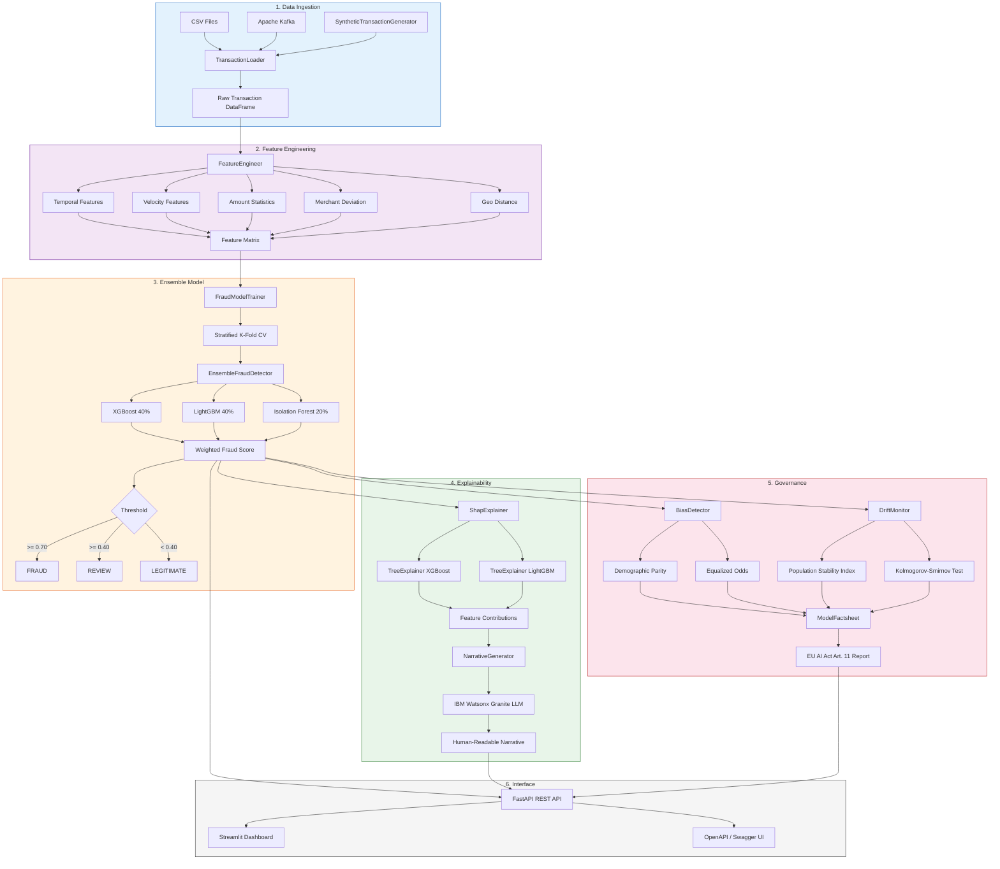
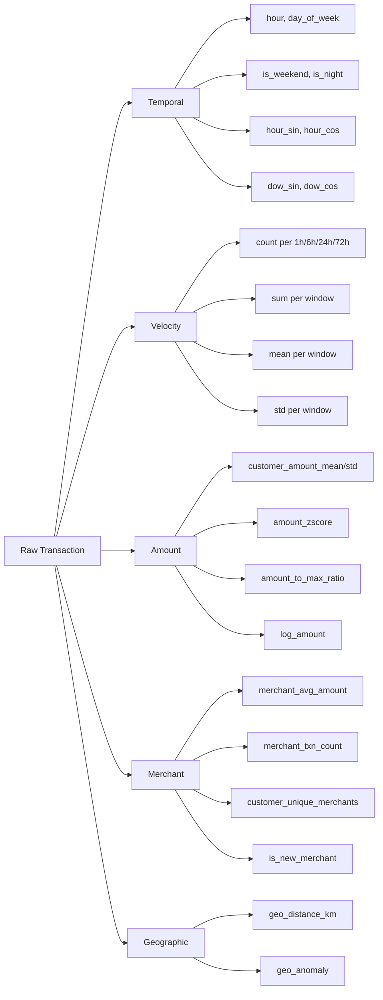
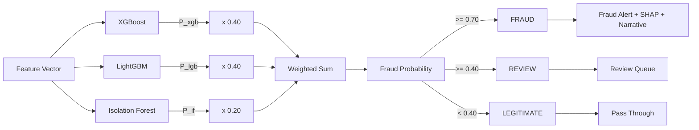
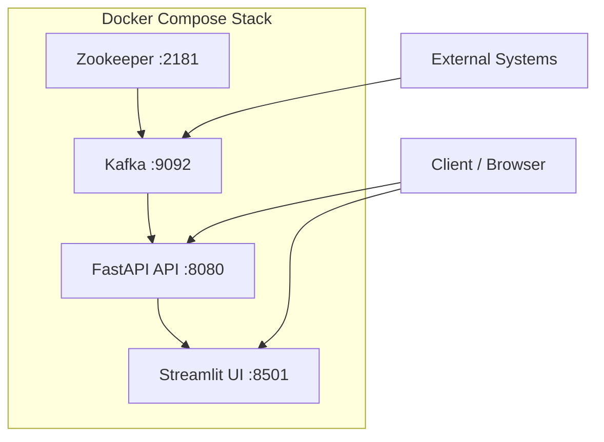

# Architecture Overview

## System Architecture

The Watsonx Financial Fraud Detection system is organized into six layers: data ingestion, feature engineering, ensemble modeling, explainability, governance, and interface.

## Module Responsibilities

### Data Layer (`src/data/`)

| Module | Class | Responsibility |
|---|---|---|
| `ingestion.py` | `TransactionLoader` | Load transactions from CSV files or Apache Kafka topics with validation and type casting |
| `synthetic_generator.py` | `SyntheticTransactionGenerator` | Generate realistic synthetic transaction data with configurable fraud rate and protected attributes |
| `feature_engineering.py` | `FeatureEngineer` | Extract temporal patterns, velocity metrics, amount statistics, merchant deviation, and geo-distance features |

### Model Layer (`src/models/`)

| Module | Class | Responsibility |
|---|---|---|
| `ensemble.py` | `EnsembleFraudDetector` | Weighted ensemble combining XGBoost (40%), LightGBM (40%), and Isolation Forest (20%) |
| `ensemble.py` | `FraudPrediction` | Dataclass holding prediction result with probabilities and per-model scores |
| `anomaly.py` | `AnomalyDetector` | Isolation Forest wrapper with normalized anomaly scores in [0, 1] |
| `trainer.py` | `FraudModelTrainer` | Training pipeline with stratified k-fold cross-validation |

### Explainability Layer (`src/explainability/`)

| Module | Class | Responsibility |
|---|---|---|
| `shap_explainer.py` | `ShapExplainer` | SHAP TreeExplainer for XGBoost and LightGBM with weighted combination |
| `shap_explainer.py` | `ShapExplanation` | Dataclass with feature contributions and top positive/negative factors |
| `narrative_generator.py` | `NarrativeGenerator` | Generate human-readable fraud alert narratives using IBM Watsonx Granite |

### Governance Layer (`src/governance/`)

| Module | Class | Responsibility |
|---|---|---|
| `bias_detector.py` | `BiasDetector` | Evaluate demographic parity and equalized odds across protected attributes |
| `drift_monitor.py` | `DriftMonitor` | Monitor data drift using PSI and KS-test per feature |
| `factsheet.py` | `ModelFactsheet` | Generate EU AI Act Article 11 compliant model documentation |

### Interface Layer (`src/api/`, `src/ui/`)

| Module | Class | Responsibility |
|---|---|---|
| `routes.py` | FastAPI `app` | REST endpoints for prediction, explanation, and governance |
| `schemas.py` | Pydantic models | Request/response validation schemas |
| `app.py` | Streamlit `main` | Interactive dashboard with investigation, alerts, governance, bias, and drift views |

## Feature Engineering Pipeline

## Ensemble Decision Flow

## Governance Compliance (EU AI Act)

| EU AI Act Article | Implementation |
|---|---|
| **Article 10 - Data Governance** | BiasDetector evaluates fairness across age, gender, geography |
| **Article 11 - Technical Documentation** | ModelFactsheet generates structured factsheet with all required metadata |
| **Article 13 - Transparency** | SHAP explanations + Granite LLM narratives for every flagged transaction |
| **Article 14 - Human Oversight** | Human-in-the-loop: all fraud-labeled transactions require analyst review |
| **Article 15 - Accuracy & Robustness** | Stratified CV metrics + continuous PSI/KS drift monitoring |

## Deployment Architecture

The system runs as a Docker Compose stack with four services:
- **Zookeeper**: Kafka coordination
- **Kafka**: Real-time transaction streaming
- **API**: FastAPI fraud detection service (port 8080)
- **UI**: Streamlit governance dashboard (port 8501)

## Configuration

All model, feature, governance, and infrastructure parameters are centralized in `config/settings.yaml` and loaded through `src/config.py` using Pydantic settings with environment variable overrides.
